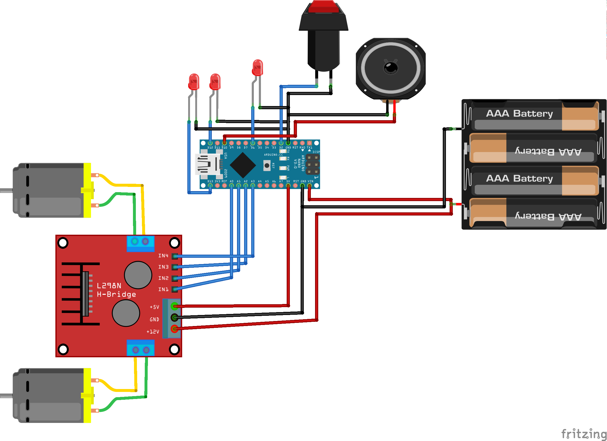
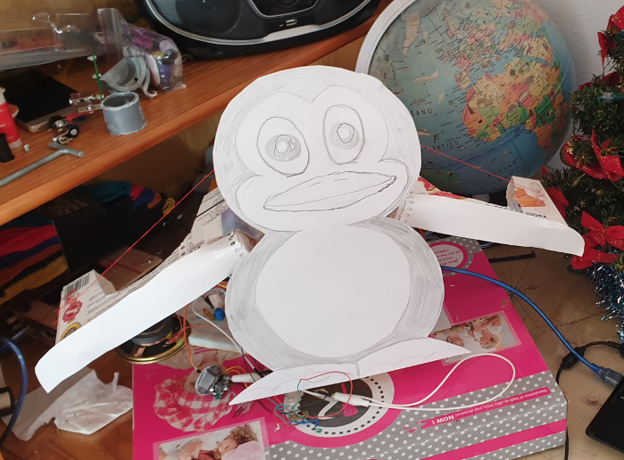
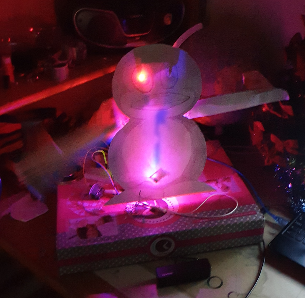

# arduino_xmas_penguin

Aproject to build xmas decoration.

# parts

1. Arduino nano
2. L298N H-bridge  motor driver
3. Speaker
4. Push button
5. wires and breadboard
6. 3 LEDs

# scheme

# end result

# in action

